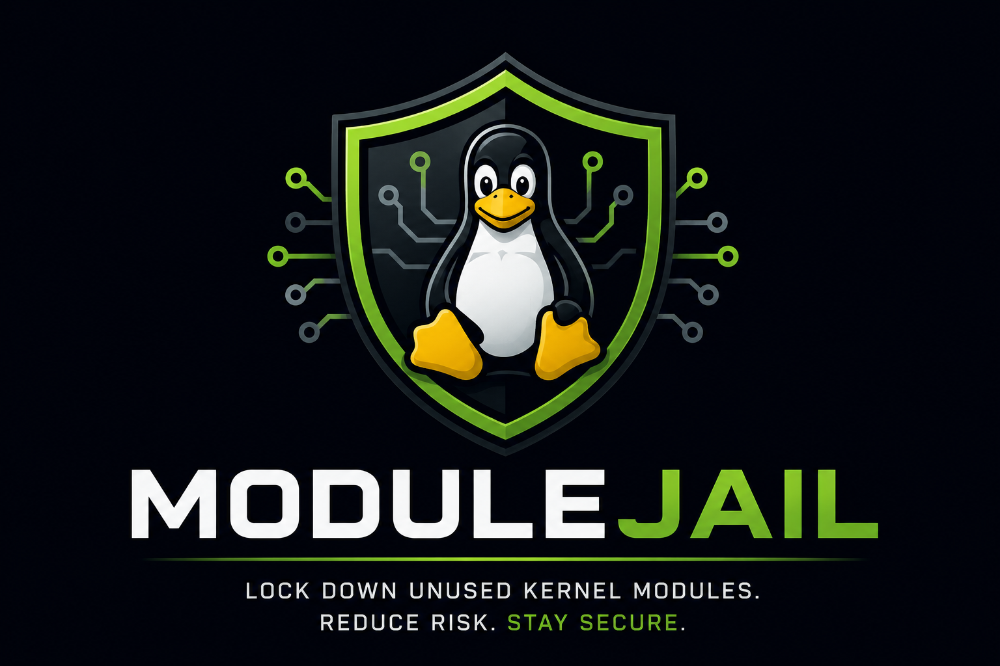

<p align="center">
  
</p>

A single POSIX shell script that shrinks a Linux host's kernel-module attack
surface by writing a `modprobe.d` blacklist for every kernel module not
currently in use, minus a built-in baseline and an optional sysadmin
whitelist. No daemons, no AI inside the tool. One script, one run, one
blacklist file. An opt-in initramfs strip hook (`--install-initramfs-hook`,
since v1.4) keeps the blacklist out of kernel cpios so module-rename across
kernel upgrades cannot leave a stale-blacklist trap.

Project page: <https://modulejail.com>. Source repository, issue tracker,
signed release tarballs, and prebuilt `.deb` / `.rpm` artifacts:
<https://github.com/jnuyens/modulejail>.

## Why?

AI-assisted security scanning is about to do to the Linux kernel what
large-scale fuzzing did to userspace code a decade ago, only faster and at a
much larger scale. Many years of latent privilege-escalation bugs in kernel
modules are about to surface in quick succession over the coming weeks and
months. Long term, this is a major win for kernel security: every disclosure
closes a door that an attacker could otherwise have walked through unseen.
Short term, it is a nightmare for sysadmins. Every public release brings
another race against patch cycles, vendor backports, and reboots across
thousands of hosts.

ModuleJail does not try to fix kernel bugs, and it cannot. It does the one
thing a sysadmin can do today, on any host, in seconds: shrink the attack
surface so that the next disclosed bug is more likely to land on a module the
host is not even loading. A typical Linux host ships with several thousand
kernel modules and uses a few hundred. ModuleJail blacklists the rest. The
next CVE in the unused 90% becomes a non-event on that host, and the fleet
operator buys time to schedule the patch on their own terms instead of
emergency-paging at 03:00.

This is intentionally a boring tool. No AI inside it, no daemon, no
continuous monitoring, no risk scoring, no CVE database lookups. Just one
shell script, run once on a steady-state host, that writes
`/etc/modprobe.d/modulejail-blacklist.conf` to blacklist the thousands of
unused modules, specific to your system.

## Threat model

ModuleJail defends against one thing: **unprivileged-user → root privilege
escalation via vulnerable kernel modules**. The threat actor is a local
user (or a compromised non-root service) who would otherwise trigger
automatic loading of a vulnerable module via an ordinary syscall -
`socket(AF_VSOCK, ...)`, `socket(AF_ALG, ...)`, `execve()` of a binary
with an obscure binfmt magic, opening a device node, and so on. The
recent "Copy Fail" CVE (CVE-2026-31431, April 2026, root via
`algif_aead`) is exactly this pattern, and the upstream mitigation every
advisory recommends - `install algif_aead /bin/false` in
`/etc/modprobe.d/` - is one line of what ModuleJail generates
automatically, applied to the entire class of unused modules.

ModuleJail does **not** defend against attackers who already have root.
Root can `insmod /path/to/module.ko` directly, bypassing `modprobe`
entirely and never consulting `modprobe.d/`. Root can also
`modprobe --ignore-install <name>` to skip the install-line indirection.
Both are intentional kernel escape hatches for root. If your threat
model includes a malicious root user, you need different tools: Secure
Boot + kernel lockdown mode, module signature enforcement, IMA/EVM, or
`kernel.modules_disabled=1` after boot settles.

For the full taxonomy of what unprivileged users can trigger, and
recipes for stacking other kernel hardening on top, see
**[docs/DEFENSE-IN-DEPTH.md](docs/DEFENSE-IN-DEPTH.md)**.

Treat ModuleJail as the "lock the front door" tool. It is the cheapest,
broadest, lowest-blast-radius layer in a kernel-hardening stack -
deploy it first; the deeper recipes compose on top.

## Quickstart

```sh
curl -fsSL https://raw.githubusercontent.com/jnuyens/modulejail/v1.4.3/modulejail | sudo sh
```

> **WARNING: convenient, not safe.** This pipes unverified bytes from the
> network to a root shell. The safer alternative below is the recommended path.

> [!TIP]
> **On a laptop or workstation? Add `-p desktop`.**
>
> The default profile is `conservative` (servers and VMs). It does NOT
> include WiFi, Bluetooth, audio, or video drivers in the baseline, so
> if any of those happen not to be loaded at run time (WiFi disconnected,
> Bluetooth off, headset unplugged, etc.), they may end up blacklisted
> and unavailable on the next boot. The `desktop` profile keeps them in
> the keep-list unconditionally.
>
> ```sh
> curl -fsSL https://raw.githubusercontent.com/jnuyens/modulejail/v1.4.3/modulejail | sudo sh -s -- -p desktop
> ```
>
> See [Profiles](#profiles) below for the full list.

The script writes its blacklist to `/etc/modprobe.d/modulejail-blacklist.conf`
by default. To use a different path:

```sh
curl -fsSL https://raw.githubusercontent.com/jnuyens/modulejail/v1.4.3/modulejail | sudo sh -s -- -o /etc/modprobe.d/site-blacklist.conf
```

## The safer alternative

Download, inspect, then run:

```sh
curl -fsSL https://raw.githubusercontent.com/jnuyens/modulejail/v1.4.3/modulejail -o /tmp/modulejail
less /tmp/modulejail
sudo sh /tmp/modulejail
```

This is the recommended path for any production deployment. The script is
plain POSIX shell and inspection takes under ten minutes.

## Native packages (.deb / .rpm / AUR)

For Debian/Ubuntu and RHEL/Fedora/Rocky hosts, prebuilt packages are attached
to the GitHub release page:

```sh
# Debian / Ubuntu:
curl -fsSLO https://github.com/jnuyens/modulejail/releases/download/v1.4.3/modulejail_1.4.3_all.deb
sudo dpkg -i modulejail_1.4.3_all.deb

# RHEL / Fedora / Rocky:
curl -fsSLO https://github.com/jnuyens/modulejail/releases/download/v1.4.3/modulejail-1.4.3-1.noarch.rpm
sudo rpm -i modulejail-1.4.3-1.noarch.rpm
```

For Arch Linux and derivatives (Manjaro, EndeavourOS, ...), modulejail is
in the AUR:

```sh
# With any AUR helper (yay shown; paru, pikaur, etc. work identically):
yay -S modulejail

# Or manually:
git clone https://aur.archlinux.org/modulejail.git
cd modulejail
makepkg -si
```

AUR package: <https://aur.archlinux.org/packages/modulejail>

On NixOS, ModuleJail generates a Nix expression instead of
a `modprobe.d` blacklist. The output is a Nix module that can be imported
into your `configuration.nix`:

```nix
{ config, pkgs, ... }:
{
  imports = [
    ./modulejail-blacklist.nix
  ];
}
```

The default output path on NixOS is `/etc/nixos/modulejail-blacklist.nix`.

The generated module emits **two** enforcement mechanisms side by side:

1. `boot.blacklistedKernelModules` - covers alias-resolution autoload
   (the path the kernel uses for socket-family `request_module`, e.g.
   `socket(AF_SCTP, ...)` triggering an `sctp` load).
2. `boot.extraModprobeConfig` - emits the same logger install line
   modulejail emits on `modprobe.d`-based distros, which intercepts
   explicit `modprobe <name>` and direct-name `request_module()` calls
   and produces a syslog event tagged `modulejail` on every blocked
   load attempt (`journalctl -t modulejail`). The logger path baked
   into the install lines defaults to `/run/current-system/sw/bin/logger`
   (util-linux); override with `MODULEJAIL_LOGGER_PATH` at generation
   time. If logger is missing at modprobe-time, the install line's
   trailing `; exit 0` still neutralizes the load attempt; only the
   syslog event is lost.

This brings the NixOS path to enforcement-and-observability parity with
the `modprobe.d` path on every other supported distro.

For Debian: @kapouer (Jérémy Lal) is packaging modulejail for the
official Debian archive - tracked in Debian BTS as
[ITP #1138266](https://bugs.debian.org/1138266) (filed 2026-05-30,
v1.3.6 targeted). Once the package clears the Debian NEW queue it
lands in Debian unstable; Ubuntu universe auto-imports from there.
Until then, Debian/Ubuntu operators should use the `.deb` from the
GitHub release page above.

All three packages install `/usr/bin/modulejail`, the `modulejail(8)` manpage
under `/usr/share/man/man8/`, and the README and LICENSE under
`/usr/share/doc/modulejail/`. They depend on `coreutils`, `findutils`, and
`awk`/`gawk` (all standard) and recommend `curl` or `wget` so the optional
post-run update check can reach GitHub. The AUR package additionally lists
`kmod` as a hard dependency (it ships `lsmod` and `modprobe`; on Debian and
RHEL families that package is pulled in by `base`/`@core` and so does not
need to be declared explicitly).

After install, `man 8 modulejail` shows the full reference: options,
profiles, safety model, idempotency, exit codes, environment, and examples.

To rebuild the packages locally from a checkout:

```sh
./packaging/build.sh           # builds whatever this host's tooling supports
./packaging/build.sh --deb     # .deb only (requires dpkg-deb)
./packaging/build.sh --rpm     # .rpm only (requires rpmbuild)
```

Output goes to `packaging/dist/`. The script skips gracefully on hosts
without the matching tooling.

## Verifying releases

Starting with `v1.3.0`, ModuleJail's release tags are GPG-signed by the
maintainer (Jasper Nuyens, `jnuyens@linuxbe.com`) using a dedicated
release-signing key (UID `ModuleJail Releases <jnuyens@linuxbe.com>`).
Fleet operators who deploy via `curl | sh` or pin a specific tag in
configuration management can verify the signature against the published
fingerprint to confirm the tarball or script they are about to install
is the exact artifact the maintainer cut. Earlier tags (`v1.0.0`
through `v1.2.4`) are NOT signed, and they will not be signed
retroactively: the existing tag SHAs are immutable references that
downstream packagers and AUR consumers already trust, and force-pushing
rewritten history would break those references.

The release-signing key fingerprint:

```
095F 5C8B 39AF 010E 7B61  5CD4 487B C00D 69C2 A955
```

(rsa4096, primary signing key, generated 2026-05-24 for the v1.3.0
release ceremony. Formatted in canonical gpg style: 10 hex groups of
4 characters, with a double-space between groups 5 and 6, matching
`gpg --fingerprint` output.)

Two ways to import the key:

```sh
# 1. From GitHub (recommended; GitHub auto-serves the maintainer's
#    uploaded public keys, no external keyserver required):
curl https://github.com/jnuyens.gpg | gpg --import

# 2. From a public keyserver (uses gpg's default keyserver pool):
gpg --recv-keys 095F5C8B39AF010E7B615CD4487BC00D69C2A955
```

Then verify the tag:

```sh
git tag -v v1.3.0
```

Expected output (literal, adapted from the Pro Git Book reference):

```
object <commit-sha-of-v1.3.0>
type commit
tag v1.3.0
tagger Jasper Nuyens <jnuyens@linuxbe.com> <unix-ts> +<tz>

v1.3.0 - Operator Flexibility & Release Hardening

gpg: Signature made <date> using RSA key 095F5C8B39AF010E7B615CD4487BC00D69C2A955
gpg: Good signature from "ModuleJail Releases (dedicated release signing key) <jnuyens@linuxbe.com>"
Primary key fingerprint: 095F 5C8B 39AF 010E 7B61  5CD4 487B C00D 69C2 A955
```

Compare the `Primary key fingerprint:` line against the value documented
above. A mismatch (or `gpg: BAD signature` / `gpg: no signature found`)
means the tag must not be trusted: do not install the corresponding
release on production hosts, and report the discrepancy upstream.

> [!TIP]
> **Maintainer-only:** to avoid forgetting the `-s` flag at tag-cut
> time, the project's local `.git/config` should have `tag.gpgsign`
> set to `true` and `user.signingkey` set to the maintainer's key ID.
> One-time setup on the maintainer's checkout:
>
> ```sh
> git config tag.gpgsign true
> git config user.signingkey <KEYID-TO-BE-FILLED>
> ```
>
> From then on, `git tag -a v1.4.3 -m "..."` auto-signs without the
> explicit `-s` flag. Replace `<KEYID-TO-BE-FILLED>` locally on the
> maintainer's machine; do NOT commit a real key ID into this README
> (the placeholder is the published form).

## What ModuleJail is

ModuleJail snapshots the set of currently loaded modules (`/proc/modules`) and
computes the complement against the full module tree
(`/lib/modules/$(uname -r)`). Every module in the complement, minus a built-in
baseline of essential modules and an optional sysadmin-supplied whitelist, is
emitted as an `install <mod>` directive in a `modprobe.d`-compatible
blacklist file. Since v1.2, the directive body is either
`/bin/sh -c 'logger -t modulejail "blocked: <mod>" ...; exit 0'` (default
when `/usr/bin/logger` is available, so blocked attempts produce a syslog
trail) or `/bin/true` (under `--no-syslog-logging`, silent fallback, or when
logger is absent). See the *Viewing blocked module attempts* section below.

The invocation used to create the blacklist file is noted in the header line
that starts with `invocation:`, and can be copied & pasted for reproducible
results.

The tool is aimed at Linux fleet operators who need to harden many servers
against the wave of AI-assisted kernel privilege-escalation discoveries. Every
additional loaded module is additional latent attack surface for the next
disclosed CVE. ModuleJail's model is simple: if it is not loaded today on a
steady-state host, blacklist it.

The script is portable across Debian/Ubuntu, RHEL/Rocky, Arch, Alpine,
SUSE, and **NixOS** families. It has no runtime dependencies beyond `awk`,
`comm`, `find`, `sha256sum`, and standard coreutils, all present in every
base Linux install including busybox. On NixOS, it automatically detects
the Nix store kernel module path and outputs a Nix expression with both
`boot.blacklistedKernelModules` (alias-resolution autoload) and
`boot.extraModprobeConfig` (install-line interception with syslog audit)
instead of a `modprobe.d` blacklist file.

## The safety model

The invariant is: **whatever is currently loaded is assumed necessary for the
host to function, and is preserved.** ModuleJail does not guess; it reads
`/proc/modules` at run time and treats that exact set as the keep-list.

This means the operator's responsibility is to run ModuleJail when the host
is in a known-good, steady-state configuration: after all services are
started, all kernel drivers are loaded, all filesystems are mounted. Running
it on a partial or in-flux system risks blacklisting a module that is
occasionally needed.

The generated file is placed under `/etc/modprobe.d/`. To revert, remove the
file (no reboot needed - see the Reverting section). The built-in baseline
ensures that core filesystems, storage controllers, and essential networking
modules are never blacklisted regardless of the running profile.

## Explicit limitations

- **Initramfs handling is opt-in.** Modules baked into initramfs are not
  the attack vector ModuleJail defends against (no unprivileged users
  exist before pivot_root; see [docs/DEFENSE-IN-DEPTH.md](docs/DEFENSE-IN-DEPTH.md)).
  However, mainstream initramfs builders (dracut, initramfs-tools,
  mkinitcpio) copy `/etc/modprobe.d/*.conf` into the cpio at build time,
  so a kernel upgrade that renames a storage driver could leave the
  new module blacklisted in the freshly-built initramfs and brick the
  next boot. The `--install-initramfs-hook` flag (since v1.4) installs
  a small per-distro hook that strips the modulejail blacklist from
  the cpio at build time. Packaged installs (.deb / .rpm / AUR) call
  the flag automatically in their post-install scripts.
- **Revert.** The revert path for the blacklist is "remove the
  generated file" (no reboot needed; the blacklist is consulted by
  `modprobe` at load time, so removing the file takes effect
  immediately). The matching `--uninstall-initramfs-hook` flag
  (since v1.4) removes the initramfs strip hook and rebuilds the
  initramfs images. Sysadmin discipline replaces tool guardrails.
- **No daemon or continuous monitoring.** One-shot script by design.
- **No AI inside the tool.** AI is the threat-model backdrop, not a feature.
- **No per-distro packaging in v1.** The curl one-liner and a cloned repo
  are the distribution channels.
- **No module risk scoring.** The model is "unused implies blacklist," not
  "vulnerable implies blacklist."
- **No kernel rebuild.** Runtime blacklist only.

## Profiles

ModuleJail ships three built-in baseline profiles. The selected profile
determines which modules are always preserved regardless of loaded state.

```sh
# Profile selection via -p (default: conservative)
sudo sh modulejail -p conservative
sudo sh modulejail -p minimal
sudo sh modulejail -p desktop
```

Profile descriptions (from `--help`):

```
  minimal       Core filesystems + essential kernel modules only
  conservative  Minimal + common server/VM drivers (default)
  desktop       Conservative + WiFi, Bluetooth, audio, video drivers
```

`conservative` is the right choice for virtualised or bare-metal server
Linux. `desktop` is for laptops and workstations where WiFi, Bluetooth,
audio, video drivers, and SD card readers (`mmc_core` / `mmc_block`,
added v1.4 after [#16](https://github.com/jnuyens/modulejail/issues/16))
must be preserved. `minimal` is for environments where you have full
control over which drivers are loaded and want the smallest possible
baseline.

### Categories deliberately NOT in any baseline

The full list lives as a comment block inside the script itself, just
below the `BASELINE_DESKTOP` definition. Notable categories that
**all three profiles** treat as blacklisted-by-default on hosts that
are not actively using them:

- **Network filesystems** — `cifs`, `nfs`, `nfsv3`, `nfsv4`, `ceph`,
  `fuse`, `9p`. Reachable via `mount(2)` with the matching fstype.
  CIFS additionally carries the `cifs.upcall` trust chain that
  CIFSwitch (May 2026) exploits via `request_key("cifs.spnego", ...)`
  — which fails with `-ENOKEY` when `cifs.ko` is not loaded.
  Operators who mount SMB shares as CIFS clients should add `cifs` to
  their `WHITELIST=`. Samba (`smbd`) and `ksmbd` SERVERS do not need
  `cifs.ko` and should leave it blacklisted.
- **Legacy / niche socket families** — `sctp`, `dccp`, `tipc`, `rds`,
  `nfc`, `vsock`, `can`, `qrtr`, `smc`, `x25`, `ax25`, `decnet`,
  `ipx`, `appletalk`, `netrom`, `rose`, `llc2`. Reachable via
  `socket(AF_X, ...)` by any unprivileged user. Many distros already
  ship `blacklist net-pf-N` for the worst legacy ones; ModuleJail
  extends that to the whole class on hosts not using them.
- **Crypto algorithm glue** — `algif_aead`, `algif_skcipher`,
  `algif_hash`, `algif_rng` (Copy Fail / CVE-2026-31431 is exactly
  this class) and the long tail of exotic algorithms (`aria`,
  `chacha20poly1305` standalone, `sm4`, `streebog`, `serpent`,
  `twofish`, `camellia`, etc.). The primitive ciphers in
  `BASELINE_CONSERVATIVE` (`aes_generic`, `aesni_intel`, `xts`,
  `cbc`, `sha256_generic`) are kept because dm-crypt / WireGuard /
  kTLS use them.
- **Other recent-CVE modules an operator is unlikely to need** —
  `rxe` (Soft-RoCE; CVE-2026-46133), `binfmt_aout`, `binfmt_em86`,
  `binfmt_flat`, niche `xt_*` netfilter helpers.

See [`docs/DEFENSE-IN-DEPTH.md`](docs/DEFENSE-IN-DEPTH.md) for the
7-tier autoload taxonomy and the threat-model framing. If your host
genuinely needs any of the above (e.g. a CIFS-client host needs
`cifs`, an NFS-client host needs `nfs`), add the specific module
names to the `WHITELIST=` line near the top of the script.

## The sysadmin whitelist

A site-local `WHITELIST` variable near the top of the script holds
space-separated module names that are always preserved, beyond the selected
baseline. It ships empty.

To use it, open the script and find the `=== SYSADMIN WHITELIST ===` section:

```sh
# === SYSADMIN WHITELIST ===
# Site-local additions to the keep-set, in addition to the selected baseline
# profile. Modules listed here will never appear in the generated blacklist.
#
# Format: space-separated module names in canonical underscore form
#         (the pipeline normalizes - to _, so either form works).
# Default: empty.
#
# Example (uncomment and adapt):
# WHITELIST='nft_compat xt_owner'
WHITELIST=''
# === END SYSADMIN WHITELIST ===
```

Edit `WHITELIST=''` to add your site-specific modules. The `===` banner
anchors are designed for Ansible template insertion (`lineinfile` or
`blockinfile`).

## Site-local whitelist file

Since v1.2, ModuleJail reads site-local modules from an external file.
This is the preferred path when you do not want to (or cannot) edit the
script in place - for instance because you install ModuleJail via
`.deb` / `.rpm` / `curl | sh` and your site-local additions would
otherwise be lost on the next reinstall.

The default path is `/etc/modulejail/whitelist.conf`. If the file
exists, ModuleJail auto-detects it and prints an `info:` line on
stderr so the choice is not silent:

```
modulejail: info: using default whitelist file /etc/modulejail/whitelist.conf (--no-whitelist-file to opt out)
```

To skip the default for a single run (e.g. during recovery), pass
`--no-whitelist-file`. To use a different location, pass
`--whitelist-file PATH`.

File format:

```sh
# /etc/modulejail/whitelist.conf
# One module per line. Blank lines and '#' comments are allowed.
# Names may be written in either dash or underscore form ("nft-compat"
# or "nft_compat") - the pipeline normalises - to _.
# The file mode MUST NOT be group-writable or world-writable
# (ModuleJail will refuse to run otherwise).

nft_compat
xt_owner
zfs
```

Three ways to invoke:

```sh
# 1. Default location (recommended for production deploys):
sudo install -d -m 0755 /etc/modulejail
sudo install -m 0644 my-whitelist /etc/modulejail/whitelist.conf
sudo modulejail   # auto-detects /etc/modulejail/whitelist.conf

# 2. Explicit non-default path (override or use a site-local NFS mount):
sudo modulejail --whitelist-file /etc/default/modulejail-whitelist

# 3. Skip the default for one run (force "no site-local additions"):
sudo modulejail --no-whitelist-file
```

The file is appended to the in-script `WHITELIST`; the two are additive.
Operators who have been editing the in-script `WHITELIST` (the v1.0
path) keep that edit untouched; the file is a no-side-effect overlay on
top.

### Module dependency resolution

A whitelisted module may itself depend on other modules that
ModuleJail would otherwise blacklist - and if those dependencies are
not also in the keep-set, the whitelisted module will fail to load
with missing-symbol errors at autoload time. The classic case is
`mmc_block` depending on `rpmb_core` on kernel 7.0+ (the RPMB code
was split out of `mmc_core` between 6.12 and 7.0); whitelisting only
`mmc_block` is not enough on those kernels.

Stock `kmod` already ships the right diagnostic: `modprobe
--show-depends MODULE` prints the full transitive insertion chain
that the kernel would walk to load `MODULE`, in load order, reading
the same `/lib/modules/$(uname -r)/modules.dep` ModuleJail uses for
its blacklist generation.

```
$ modprobe --show-depends mmc_block
insmod /lib/modules/.../rpmb-core.ko
insmod /lib/modules/.../mmc_core.ko
insmod /lib/modules/.../mmc_block.ko
```

To extract the names in underscore form and append them to the
whitelist file in one go:

```sh
modprobe --show-depends mmc_block \
    | awk '/^insmod/ {print $2}' \
    | sed -E 's|.*/||;s|\.ko\..*$||;s|-|_|g' \
    | sudo tee -a /etc/modulejail/whitelist.conf
```

Run that for each module you want, then re-run `modulejail`. ModuleJail
itself does not currently walk the dependency tree of whitelisted
modules - the operator is responsible for resolving and listing the
full closure. (Discussion at
[gh #16](https://github.com/jnuyens/modulejail/issues/16) on whether
to add transitive-dependency resolution to the keep-set computation.)

ModuleJail enforces two safety gates on the file:

1. **File mode must not be group- or world-writable.** The same
   hardening sshd applies to `authorized_keys` and sudo applies to
   `sudoers`. If the file is `g+w` or `o+w`, ModuleJail refuses to run
   and prints `chmod go-w PATH` as the hint. Exit code is `77`
   (`EX_NOPERM`). Rationale: the module names from this file land in
   the generated `modprobe.d` directives, so an attacker with write
   access to a shared sysadmin group could otherwise inject `install`
   stanzas the kernel would later run.
2. **Each line must match `[a-zA-Z0-9_-]+`.** Comments (`#`) and blank
   lines are skipped silently; everything else must be a plain module
   name. Any malformed line is rejected with a stderr message citing
   the file path, line number, and offending content. Exit code is
   `65` (`EX_DATAERR`).

## Viewing blocked module attempts

Since v1.2, when `/usr/bin/logger` is executable on the host running
ModuleJail (and `--no-syslog-logging` is not set), the generated
install lines call `logger -t modulejail "blocked: <module>"` so a
later `modprobe <module>` attempt produces a syslog entry tagged
`modulejail`:

```sh
# systemd hosts (journald):
sudo journalctl -t modulejail --since '1 hour ago'

# classic syslog hosts:
sudo grep modulejail /var/log/syslog
```

The generated file's header annotates which install-line form is in
use. Look for:

```
# install-line: /bin/sh + logger (syslog tag: modulejail)
```

To opt out and restore the exact v1.1.4 `/bin/true` install-line body
(useful for byte-identical regression contracts, hosts without
`logger`, or minimal/initramfs builds), pass `--no-syslog-logging`:

```sh
sudo modulejail --no-syslog-logging
```

The header annotation then reads:

```
# install-line: /bin/true (silent, --no-syslog-logging or logger absent)
```

If `/usr/bin/logger` is absent on the host AND `--no-syslog-logging`
was not set, ModuleJail silently falls back to the `/bin/true` form
(matching the v1.1.4 behaviour on minimal hosts). No stderr warning is
emitted; the header annotation is the only visible cue.

## Failing on blocked module loads (`-f` / `--fail-on-module-load`)

By default, blacklisted module loads succeed silently: the generated
install lines end with `exit 0` (when logger is present) or `/bin/true`
(when it is not), so `modprobe <module>` returns 0 even though the module
was not actually loaded. This is the safe default — it prevents
breakage in scripts and services that unconditionally call `modprobe`
and check its return code.

To make blocked loads fail loudly instead, pass `-f` or
`--fail-on-module-load`:

```sh
sudo modulejail -f
sudo modulejail --fail-on-module-load
```

With this flag, the install-line body uses `/bin/false` instead of
`exit 0` or `/bin/true`, so `modprobe <module>` returns a non-zero exit
code for blacklisted modules. This is useful when you want tooling to
detect and alert on blocked module attempts rather than silently
swallowing them.

The header annotation reflects the mode:

```
# install-line: /bin/sh + logger + /bin/false (syslog tag: modulejail, --fail-on-module-load)
```

or, without logger:

```
# install-line: /bin/false (silent, --fail-on-module-load)
```

## Scope of the blacklist (what it blocks, what it doesn't)

A `modprobe.d` blacklist blocks **automatic** module loading: udev
events on hardware hotplug, dependency resolution during
`modprobe foo`, autoloaded modules through the alias system. It does
**not** block, by design:

- `insmod /path/to/module.ko` - `insmod` bypasses `modprobe` entirely
  and never reads `modprobe.d/`. A root user with intent can always
  insert a module directly.
- `modprobe --ignore-install <name>` - `modprobe`'s explicit escape
  hatch. The user is opting out of the install-line indirection that
  ModuleJail relies on.

Both are intentional escape hatches in the kernel module loader.
ModuleJail is a default-safe policy layer: it removes the
auto-loading attack surface (udev hotplug + dependency resolution),
which is what an unprivileged or remote attacker has to work with. It
does not - and could not - prevent a root user with intent from
loading anything they want. See the [Threat model](#threat-model)
section above for the full framing, and
[docs/DEFENSE-IN-DEPTH.md](docs/DEFENSE-IN-DEPTH.md) for recipes that
close the root-with-intent gap (kernel lockdown mode, module signature
enforcement, `kernel.modules_disabled=1`).

## FAQ

### Does ModuleJail protect against in-use-module CVEs like CVE-2026-23111 (nf_tables LPE)?

Short answer: **only on hosts that don't already load the vulnerable
module**. ModuleJail's model is "unused -> blacklist," not "vulnerable
-> blacklist." If `nf_tables` is in `lsmod` at scan time (any host
running nftables, firewalld, iptables-nft, ufw on modern Debian/Ubuntu,
or systemd's own nft hooks), ModuleJail preserves it - the bug surface
stays reachable and patching the kernel is the only fix.

The protected population is hosts where the vulnerable module is *not*
loaded at scan time:

| Host shape | `nf_tables` loaded at scan | Protected? |
|---|---|---|
| Server running nftables / firewalld / iptables-nft | yes | no - kernel patch required |
| Server with legacy iptables only, or no firewall configured | no | yes |
| Minimal cloud VM / container host / CI runner with no nft | no | yes |

On a host where `nf_tables` is unloaded, an unprivileged user can
otherwise trigger the autoload via:

```sh
unshare -Urn                                  # userns gives CAP_NET_ADMIN in the new netns
# then in the namespace:
# socket(AF_NETLINK, SOCK_RAW, NETLINK_NETFILTER) -> autoloads nfnetlink
# sendmsg(... NFNL_SUBSYS_NFTABLES ...)          -> autoloads nf_tables
```

That is the same primitive every public nft-CVE PoC uses. With
ModuleJail active, the `install nf_tables /bin/sh -c '... exit 0'`
line in `/etc/modprobe.d/modulejail-blacklist.conf` causes
`/sbin/modprobe` (invoked by the kernel via `request_module()`) to
no-op the load. The `socket()` ultimately fails with `-EAFNOSUPPORT`
and the vulnerable code is never reached - even from inside a user
namespace, since the autoload happens in init's namespace where the
install line lives.

Two caveats:

1. **Built-in kernel:** if `CONFIG_NF_TABLES=y` (compiled in, not
   modular), `install` lines do nothing. Stock Debian/Ubuntu/Fedora/Arch
   ship `=m`, so this is rare in practice -
   `grep CONFIG_NF_TABLES /boot/config-$(uname -r)` confirms.
2. **In-use modules:** if the host actively uses nftables, neither
   ModuleJail nor any other blacklist can help against this CVE.
   Patch the kernel and disable unprivileged user namespaces
   (`sysctl -w kernel.unprivileged_userns_clone=0` on Debian/Ubuntu, or
   `sysctl -w user.max_user_namespaces=0` on Fedora/Arch). The
   userns-disable step alone neutralises the entire class of
   "unprivileged user gets CAP_NET_ADMIN" LPE chains, of which this
   CVE is one.

The general framing applies to any future "popular module + userns
LPE" CVE: ModuleJail shrinks the *autoload* surface, which covers
hosts where the module wasn't going to be used anyway. For hosts that
*do* use the vulnerable module, kernel patching plus
`unprivileged_userns_clone=0` is the structural defence; ModuleJail
is the complement, not the substitute. See
[docs/DEFENSE-IN-DEPTH.md](docs/DEFENSE-IN-DEPTH.md) for the layered
picture.

## Options reference

| Option | Description |
|--------|-------------|
| `-p`, `--profile {minimal\|conservative\|desktop\|none}` | Built-in baseline profile (default: `conservative`). `none` carries no built-in baseline at all - only currently-loaded modules and any `--whitelist-file` entries are preserved. Recommended only when an explicit `--whitelist-file` is supplied (since v1.3) |
| `-o`, `--output PATH` | Output path for the generated blacklist file (default: `/etc/modprobe.d/modulejail-blacklist.conf`) |
| `--whitelist-file PATH` | Append module names from PATH to the keep-set. One module per line; `#` starts a comment. File must be owned by root (or by the invoking user) and must not be group- or world-writable; the error message proposes the exact `sudo chown` / `sudo chmod` command to fix. Default: `/etc/modulejail/whitelist.conf` (since v1.4 the default path is the recommended home for site-local additions instead of editing the in-script `WHITELIST=` line) |
| `--no-whitelist-file` | Skip the default whitelist file even if present. Mutually exclusive with `--whitelist-file PATH` |
| `--no-syslog-logging` | Force `/bin/true` install lines (v1.1.4 behavior). By default, blocked module loads are logged to syslog with tag `modulejail` |
| `-f`, `--fail-on-module-load` | Blocked module loads return a non-zero exit code (`modprobe` fails loudly). Default: blocked loads silently succeed |
| `--verbose-logging` | Enrich the per-blocked-load `logger` call with the caller's `ppid`, `loginuid`, `pcomm`, and `pexe` (read from `/proc/$PPID/...`). Requires `/usr/bin/logger`; mutually exclusive with `--no-syslog-logging`. Default `logger` output is the bare `"blocked: <module>"` form (since v1.3.4) |
| `--dry-run` | Compute the would-be blacklist and print a summary to stdout; do NOT write the output file or touch `/etc/modprobe.d/`. Header is rerouted to stderr. Exit code is `0` on simulated success (since v1.3) |
| `--quiet` | Suppress all non-error stderr output (info lines, summary, header echo). Errors still surface. Mutually exclusive with `--verbose` (since v1.3) |
| `--verbose` | Emit per-module decision lines on stderr (which module was kept, which was blacklisted, and why). Mutually exclusive with `--quiet` (since v1.3) |
| `--output-format {json\|logfmt}` | Emit a machine-readable run summary to stdout instead of the default human-readable summary. JSON round-trips through `jq`; logfmt round-trips through standard logfmt parsers. 11-field schema v1 (`kernel_version`, `modules_available`, `modules_loaded`, `modules_blacklisted`, `fingerprint`, `output_path`, ...). Survives `--quiet` (since v1.3) |
| `--install-initramfs-hook` | Detect the active initramfs builder (dracut, initramfs-tools, mkinitcpio) and install a small hook that strips `modulejail-blacklist.conf` from rebuilt initramfs cpios. Closes the upgrade-then-stale-blacklist trap (gh #19). Requires root. Prints the operator-runnable rebuild command after writing; does not rebuild the initramfs (operator schedules that on their own time). Pair with `--dry-run` to print what would be written without touching any file (since v1.4) |
| `--uninstall-initramfs-hook` | Remove all four possible hook file paths regardless of which builder is currently detected (handles distro migrations). Prints the rebuild command afterwards. Requires root (since v1.4) |
| `-y`, `--yes` | Skip the interactive confirmation prompt that `--self-update` would otherwise present. Required for non-interactive invocations (postinst, cron, systemd-run) since `--self-update` refuses to apply silently from a non-tty (since v1.4) |
| `--self-update` | Fetch the latest stable release from GitHub, preview it (incl. SHA-256 of the downloaded bytes), and prompt interactively before replacing the running script in place. Pass `-y` / `--yes` to skip the prompt (required for non-interactive invocations: postinst, cron, systemd-run). Operator edits to the `SYSADMIN WHITELIST` region of the script are preserved via marker-bracketed splice. External whitelist files (`--whitelist-file PATH` or the default `/etc/modulejail/whitelist.conf`) are NOT touched. Pair with `--dry-run` to preview without prompting. Detects packaged installs (dpkg/rpm/pacman) and prints a warning; prefer `apt upgrade` / `dnf upgrade` / `pacman -Syu` on packaged hosts. Requires `curl` or `wget` (since v1.4) |
| `-V`, `--version` | Show program version and exit |
| `-h`, `--help` | Show help text and exit |

Environment variables:

| Variable | Description |
|----------|-------------|
| `MODULEJAIL_NO_UPDATE_CHECK` | Set to any non-empty value to skip the post-run update check |
| `MODULEJAIL_LOGGER_PATH` | Path to the logger binary for syslog install-line detection (default: `/usr/bin/logger`) |
| `MODULEJAIL_DEFAULT_WHITELIST_FILE` | Override the auto-detected whitelist path (default: `/etc/modulejail/whitelist.conf`) |
| `MODULEJAIL_INITRAMFS_BUILDER` | Force the initramfs builder detection used by `--install-initramfs-hook` / `--uninstall-initramfs-hook` to one of `dracut`, `initramfs-tools`, `mkinitcpio`. Test-only plumbing (since v1.4) |
| `MODULEJAIL_ON_NIXOS` | Force NixOS mode (`1`) or non-NixOS mode (`0`). When set to `1`, generates Nix expression syntax with `boot.blacklistedKernelModules`. When set to `0`, forces traditional `modprobe.d` output even on NixOS. Test-only plumbing. Auto-detected from `/run/booted_system` or `/etc/os-release` when unset (since v1.5) |

## Exit codes

Exit codes follow `sysexits.h` conventions (see `man 3 sysexits`). Fleet
automation tools can `case $?` cleanly.

| Code | Meaning |
|------|---------|
| 0    | success |
| 64   | command-line argument error (bad flag, missing value, unknown profile) |
| 65   | invalid data in `--whitelist-file` (malformed module name) |
| 66   | required kernel input missing (`/proc/modules` or `/lib/modules/<kernel>`) |
| 70   | sanity guard tripped (empty blacklist or >99% of modules blacklisted) |
| 71   | OS-level error (mktemp work dir, or find errors on `/lib/modules`) |
| 73   | output path cannot be created (symlink/directory/trailing-slash, or mktemp failure) |
| 77   | target directory not writable (try sudo, or use `-o <other-path>`) |

## Idempotency contract

Two consecutive runs on an unchanged host produce byte-identical output
files. The generated blacklist header carries a sha256 run fingerprint, not
a wall-clock timestamp, computed over the canonical inputs: sorted
loaded-module set, sorted baseline set, sorted whitelist, profile name, and
kernel version. Because the fingerprint is a deterministic function of
inputs, identical inputs produce an identical fingerprint and thus an
identical output file.

```
# fingerprint: sha256:e284ee9741eb544adf1af6c0fffc162dedd6029191673237a8155cd497908686
```

Fleet operators can use the fingerprint to correlate "what was on the host
at hardening time" across machines: two hosts with the same fingerprint had
identical loaded sets, baseline, whitelist, profile, and kernel version when
ModuleJail ran. No wall-clock drift, no spurious diffs in configuration
management systems.

## Update check

After a successful run, ModuleJail performs a best-effort lookup against the
GitHub tags API to see whether a newer release is available. The check has a
10-second hard timeout and is silent on every failure mode (no network, no
`curl` or `wget` installed, parse failure, current version equal to or newer
than the latest tag). It only prints a stderr notice when the upstream
release is strictly newer than the running version.

To disable the check entirely (for offline fleets, restricted networks, or
pipeline-style automation where any unexpected output is noise), set:

```sh
export MODULEJAIL_NO_UPDATE_CHECK=1
```

The check fires only on a successful run. Error paths (bad arguments,
missing `/proc/modules`, sanity-guard trip, etc.) exit before reaching it.

## Cross-distro support

ModuleJail has been verified across two confidence tiers.

### Real-kernel tier (live SSH hosts)

| Distro | Kernel | Result |
|--------|--------|--------|
| Ubuntu 24.04.4 LTS (Noble Numbat) | 6.8.0-110-generic | PASS (6363 of 6474 modules blacklisted) |
| Debian GNU/Linux 13.4 (trixie) | 6.12.74+deb13+1-amd64 | PASS (4091 of 4227 modules blacklisted) |
| Rocky Linux 9.7 (Blue Onyx) | 5.14.0-503.35.1.el9_5.x86_64 | PASS (2253 of 2338 modules blacklisted) |
| Arch Linux (rolling, 2026-05-23) | 7.0.9-arch2-1 | PASS (6416 of 6481 modules blacklisted) |
| **NixOS 26.05** | 6.18.34 | **PASS** (7002 of 7296 modules blacklisted, Nix expression output) |

Note for Rocky/RHEL hosts: on hosts with strict SELinux enforcement,
non-root execution may encounter a `find` permission denial on
`/lib/modules/`, causing exit code 71 (`EX_OSERR`). This is expected,
documented behaviour. Use `sudo`, or relax the relevant SELinux policy, if
this occurs.

### Fixture-container tier (synthetic kernel module trees)

| Distro | Base image | Shell | Result |
|--------|-----------|-------|--------|
| Arch Linux (latest) | `archlinux:latest` | `/bin/sh` (bash) | PASS (10/10 assertions) |
| Alpine Linux (latest) | `alpine:latest` | busybox ash | PASS (10/10 assertions) |
| openSUSE Tumbleweed | `opensuse/tumbleweed:latest` | `/bin/sh` | PASS (10/10 assertions) |

Fixture containers run against a synthetic
`/lib/modules/6.99.0-fixture/` tree with representative `.ko`, `.ko.gz`,
`.ko.xz`, and `.ko.zst` files to exercise all four suffix variants.

The `MODULEJAIL_PROC_MODULES` and `MODULEJAIL_KVER` environment variables
are test-only plumbing (analogous to `TMPDIR` or `GIT_DIR`) used by the
fixture harness to point the script at synthetic `/proc/modules` and module
tree paths. End-user operators leave these unset.

## Reverting

Remove the generated file. The blacklist is consulted by `modprobe` at
load time, not loaded into the kernel persistently, so removing the file
takes effect immediately - no reboot needed.

```sh
# Full revert (instant, no reboot needed):
sudo rm /etc/modprobe.d/modulejail-blacklist.conf

# Selective: bring back a specific module right now, even while the
# blacklist file is still in place (`modprobe` is the explicit-load
# path that overrides the blacklist):
sudo modprobe <module_name>
```

If you installed the initramfs strip hook (`--install-initramfs-hook`,
since v1.4), the matching uninstall removes the hook file(s) and
rebuilds every initramfs image so the removal applies immediately:

```sh
sudo modulejail --uninstall-initramfs-hook --yes
```

Packaged installs (.deb / .rpm / AUR) call this from their `prerm` /
`%preun` scriptlets automatically.

The generated file uses `install <module> ...` directives (with either a
`/bin/sh + logger` body or `/bin/true`, see *Viewing blocked module
attempts* above), which block autoloading via udev events and dependency
resolution. Explicit `sudo modprobe <name>` invocations override the
blacklist immediately, regardless of whether the file is still present.
If the file is still in place, the override applies only to that single
explicit load - subsequent autoload attempts (from udev or other modules
requiring the named module as a dependency) will be blocked again. To
make the unblock permanent, remove the blacklist file. See *Scope of the
blacklist* above for the precise list of what `modprobe.d` install
directives do and do not intercept.

## Community resources

Operator-authored knowledge bases and packaging maintained outside
the upstream repo:

- **Manjaro forum HOWTO** - community wiki post covering installation
  via AUR, per-profile usage notes, operator-curated whitelist
  examples, and a reference database of 20+ kernel modules and the
  programs that need them. Authored by @andreas85; collaboratively
  edited (wiki-post format). https://forum.manjaro.org/t/howto-modulejail/187877
- **AUR packages** - Arch Linux User Repository.
  - [`modulejail`](https://aur.archlinux.org/packages/modulejail) -
    tagged-release package, maintained by upstream. Tracks the latest
    `vX.Y.Z` GitHub release.
  - [`modulejail-git`](https://aur.archlinux.org/packages/modulejail-git) -
    rolling-from-master package, maintained by @tjmnmk (with upstream
    as co-maintainer). Rebuilds from `master` HEAD on every
    `pacman -Syu`. For developers and early adopters; production
    operators should stay on `modulejail`.

Have something to add? Open an issue or PR to extend this list; the
project intentionally keeps these pointers in-repo rather than
proliferating them across the documentation surface.

## Contributing

### Branching model

- **`master`** tracks the latest stable release (currently `v1.4.3`).
  Every commit on `master` is shippable. Hotfixes to the current
  stable line and small backward-compatible improvements (docs,
  packaging, small baseline additions) land here.
- **`v1.5-dev`** (and similar `vX.Y-dev` branches in the future) is
  the integration branch for an in-flight major or minor milestone.
  Feature PRs that target a future release go here. Prereleases
  (`vX.Y.0-beta.N`, `vX.Y.0-rc.N`) are cut from this branch.
- When the milestone reaches stable, `vX.Y-dev` is merged into
  `master` and the next milestone's dev branch is created.

PRs:

- Bug fixes / small docs / packaging-only changes -> base against
  `master`.
- New features / non-trivial behavior changes -> base against the
  current dev branch (`v1.5-dev` at the time of writing).
- Unsure? Open the PR against `master`; we will retarget if needed.

The AUR `modulejail-git` package builds from `master` HEAD (= rolling
stable), not from the dev branch, so rolling-AUR users always get
shippable code.

### Baseline-addition policy (since v1.3.4)

Suggestions to add a module to `BASELINE_CONSERVATIVE` or
`BASELINE_DESKTOP` are evaluated against a single rule:

> Modules join a baseline only when there is observed operator pain in
> that profile's target audience. CONSERVATIVE target =
> bare-metal/VM Linux servers (hands-on admins, post-steady-state
> runs). DESKTOP target = laptops/workstations (set-and-forget UX,
> ModuleJail may run at any time including before all udev/late-load
> events have settled). *"Defensive add because the kernel sometimes
> loads it late"* is insufficient justification - a real operator-
> reported breakage in the relevant profile's target audience is the
> bar.

The implication for issue / PR authors: when proposing a baseline
addition, link the operator-side breakage report or describe the
concrete workflow that breaks. Module names that don't have a
real-world breakage report are better placed in your local
`WHITELIST=` variable (or community-curated lists like the Manjaro
forum HOWTO linked in *Community resources* below).

`acpi_cpufreq` in `BASELINE_CONSERVATIVE` predates this policy
(added in v1.3.2 with the same speculative reasoning the policy now
disallows). It is retained for backward compatibility; no future
additions follow the same pattern.

### Tests

The test matrix lives in `tests/`. Both harnesses are POSIX shell scripts
runnable by anyone with the prerequisites:

```sh
# Container fixture suite (Arch/Alpine/openSUSE):
# Requires: docker or podman; exits 77 if neither is found (graceful skip).
./tests/run-fixtures.sh

# Real-SSH-host acceptance suite:
# Requires: SSH key access to the hosts configured in the harness.
./tests/run-ssh-hosts.sh
```

`./tests/run-fixtures.sh` exits 77 on any host without a container runtime;
that is the documented graceful degradation (autoconf/TAP skip convention).
Run it on a Linux host with Docker or Podman.

Both harnesses are shellcheck-clean (`shellcheck --shell=sh`).

Host-local cases include a NixOS-specific test (`nixos-nix-output.sh`)
that verifies the kernel module path detection and Nix expression output
format. The test runs on any Linux host but exercises NixOS code paths by
setting `MODULEJAIL_ON_NIXOS=1` in the test environment.

## Star History

<a href="https://www.star-history.com/#jnuyens/modulejail&Date">
 <picture>
   <source media="(prefers-color-scheme: dark)" srcset="https://api.star-history.com/svg?repos=jnuyens/modulejail&type=Date&theme=dark" />
   <source media="(prefers-color-scheme: light)" srcset="https://api.star-history.com/svg?repos=jnuyens/modulejail&type=Date" />
   
 </picture>
</a>

## License

Copyright (C) 2026 Jasper Nuyens <jnuyens@linuxbe.com>

GPL-3.0-only. See the [LICENSE](LICENSE) file for the full text.
